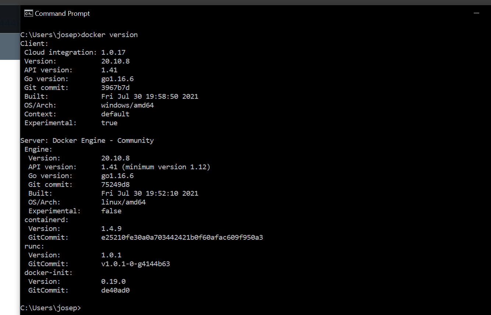
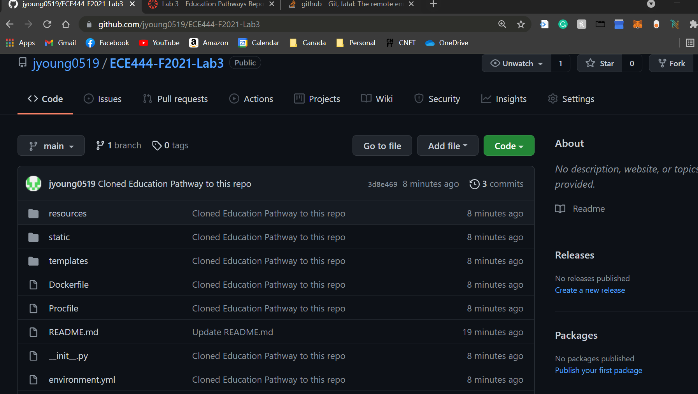
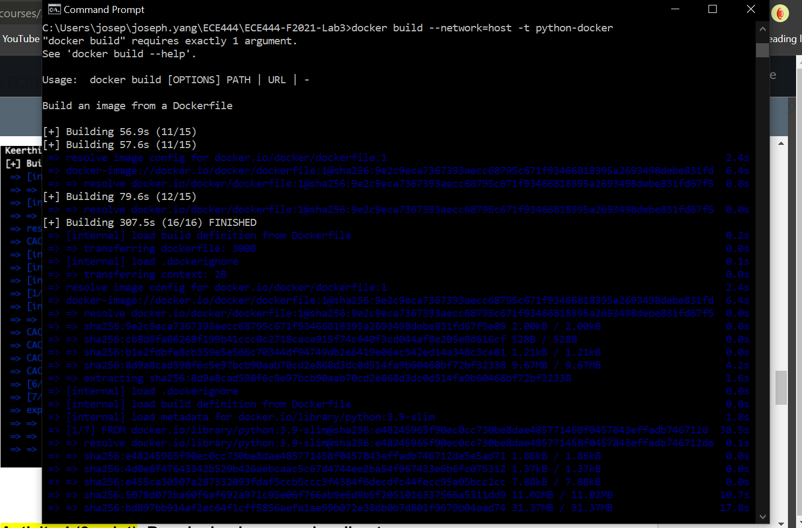
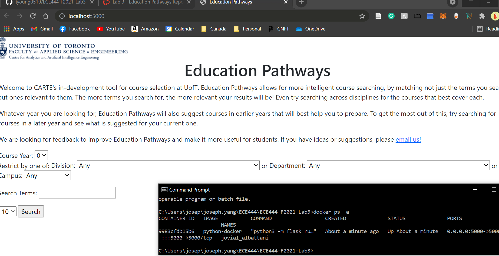

# ECE444-F2021-Lab3
# NAME: EN-MIEN (JOSEPH) YANG
# this   repo   is   a   clone   of https://github.com/nelaturuk/education_pathways.

# ACTIVITY 5
# The functional requirement I would like to see improving the system must show course information to the # student. This particular one I picked since when I search about a course, the information displayed are # outdated. Not having relevant or accurate data defeat the whole purpose of the application.

# The non-fuctional requirement I am picking is for sure the UI asthetic. Going into this page, one would # feel the page is still under development. Having poor design and unintuitive UI will discourage the 
# users from using it

